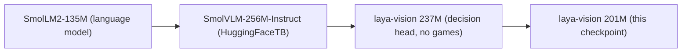
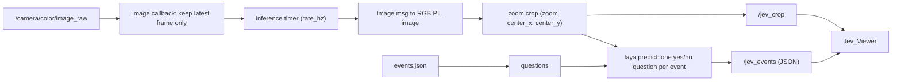
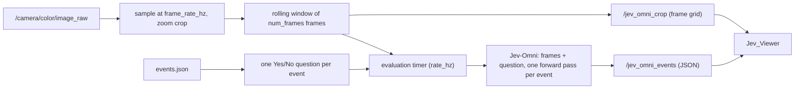

# jev_event_detector

Camera-based event detection for the mechanical pen task on the LEAP+Xela hand. The package has three nodes:

- **`jev_laya_vision_detector`** watches `/camera/color/image_raw`, asks a small vision-language model a yes/no question for each event in [`events.json`](jev_event_detector/events.json) (pen visible, slipping, fell off, ...) about the latest **single frame**, and publishes the probabilities on `/jev_events`.
- **`jev_omni_event_detector`** answers the same questions about a **short clip** of recent frames with the much larger Jev-Omni model, so it can see motion, and publishes on `/jev_omni_events`. See [Jev-Omni detector](#jev-omni-detector-video).
- **`jev_viewer`** (ROS node name `Jev_Viewer`) is a Qt window showing the image a detector is looking at, with one probability bar per event.

The package is standalone: no other package depends on it, and it only talks to the rest of the system through the camera topic and its own output topics.

## Quick start

```bash
cd /workspace/LeapXELA_Hardware_ws/ros_ws
source /opt/ros/humble/setup.bash
colcon build --packages-select jev_event_detector
source install/setup.bash
ros2 launch jev_event_detector launch_jev.py            # detector + viewer
```

The camera must be publishing, either from the RealSense driver or from `ros2 bag play <bag>`. The model takes about 5 s to load. Run `ros2 launch jev_event_detector launch_jev.py --show-args` to list the launch arguments.

## Where the model comes from

The detector runs [thaitea/laya-vision](https://huggingface.co/thaitea/laya-vision), loaded through the `laya` Python library from [github.com/r33drichards/laya-vision](https://github.com/r33drichards/laya-vision).

**Lineage.**



- **Base.** SmolVLM-256M-Instruct, a small image+text model from Hugging Face. Its language model is SmolLM2-135M.
- **Laya.** Laya is a method by Convai Innovations for getting *typed, calibrated decisions* out of a language model in one forward pass, instead of generating text. `laya-vision` is an independent research fork that applies Laya to images. It is not affiliated with Convai Innovations.
- **This checkpoint (201M parameters).** It started from the earlier 237M `laya-vision` checkpoint, cut to the first 20 of its 30 language-model layers. The 12-layer vision tower was kept and frozen. It was then trained for 2 hours on one H100 (28,414 steps at batch 64, about 1.8M samples) on:
  - 19 closed-answer subsets of [The Cauldron](https://huggingface.co/datasets/HuggingFaceM4/the_cauldron);
  - 4 rubric-scored image sets (VLFeedback, AVA, RichHF-18K, CrisisMMD);
  - game frames (mazes, Snake, classic control, Atari, ViZDoom), which made up 45% of the training draws.

  The recipe was picked by an automated search ("autoresearch") that trains candidate recipes for 15 minutes each and keeps those that improve the trade-off between quality, game play, size and speed.
- **Training objective.** Soft cross-entropy plus a strictly proper scoring rule, with option order shuffled. Per-question-type temperatures were fitted afterwards on a held-out calibration set (yes/no questions: T = 3.05), so its probabilities are meant to be usable at face value *on data like its training data*.
- **Reported accuracy.** 71.4% on VQAv2 yes/no questions, 59.8% on A-OKVQA, 82.4% on ScienceQA (images), and a calibration error (ECE) of 0.041 across 34 validation sets.

**Licence.** The weights are **CC BY-NC-SA 4.0**, which means **non-commercial use only**: the training data includes ScienceQA and CrisisMMD, which carry that licence. The `laya` code is Apache 2.0, and so is the SmolVLM base model.

## How the detector works



### 1. Events become questions

On startup, every entry in `events.json` becomes a Laya `noul` (yes/no) question:

```python
{"type": "noul", "instructions": f"{description}. Is this happening in the image?"}
```

Adding, removing or rewording an event only requires editing `events.json`; the viewer picks up new events automatically too. The installed copy is the one that gets read, so rebuild after editing, build once with `--symlink-install`, or point the `events_file` parameter at the source file.

### 2. Frames: latest only, at a fixed rate

The camera sends about 30 frames per second, which is more than the model needs. The image callback only stores the newest frame. A timer running at `rate_hz` (5 Hz by default) takes that frame and runs the model on it, so frames never queue up behind slow inference, and the node always judges the most recent image. The timer and the image callback run on a multi-threaded executor, so new frames keep arriving while inference runs.

Image messages are converted with NumPy rather than `cv_bridge`. The ROS Humble `cv_bridge` here was built against NumPy 1.x and segfaults under the NumPy 2 that `torch` needs. The `rgb8`, `bgr8`, `rgba8`, `bgra8` and `mono8` encodings are supported.

### 3. Zoom crop

The model shrinks every image to one 512 px tile, so in a full 1920x1080 frame the pen is only a few pixels thick and hard to see. `zoom` crops the frame first:

- `zoom` 1.0 keeps the full frame, 2.0 keeps half the width and height, 3.0 a third;
- the crop keeps the camera's aspect ratio and is centred at (`center_x`, `center_y`), given as fractions of the frame, where (0, 0) is the top left;
- if the crop would go off the edge, it is shifted back inside the image.

On a test frame with the pen resting on the palm, the probability that the pen was visible went from about 0.17 on the full frame to 0.89 at zoom 2.0. The cropped image is published on `/jev_crop`, but only while something is subscribed to it, such as the viewer.

### 4. One forward pass per frame

`laya` encodes the image once and scores every question against it, reading a probability for "true" directly from the model's output. No text is generated. This takes about 45 ms per frame on the GPU, for five questions.

Each event's probability `p` is **independent**: the probabilities do not sum to 1, and several events can be likely at the same time. If you need one distribution over mutually exclusive states, use a single Laya `choice` question instead.

### 5. Output

Each processed frame is published on `/jev_events` as a `std_msgs/String` containing JSON:

```json
{"stamp": 1791300057.79, "frame_id": "camera_color_optical_frame",
 "events": {"success": {"p": 0.31, "fired": false},
            "I_can_see_the_pen": {"p": 0.89, "fired": true}},
 "fired": ["I_can_see_the_pen"], "latency_ms": 45.7}
```

- `stamp` and `frame_id` come from the camera image that was evaluated.
- `fired` is `p >= threshold` for **this frame only**. It does not latch, so an event whose `p` hovers near the threshold flickers.
- The top-level `fired` list names the events fired in this message.

The node also logs `Event 'x' fired (p=...)` when an event crosses the threshold, and every 5 s it logs frame counts, mean latency and the latest probability for each event, one per line.

### Parameters

| Parameter | Default | Meaning |
|---|---|---|
| `image_topic` | `/camera/color/image_raw` | Camera input |
| `events_topic` | `/jev_events` | JSON output |
| `crop_topic` | `/jev_crop` | Cropped image output |
| `events_file` | installed `events.json` | Events to detect |
| `zoom` | 1.0 (2.0 in the launch file) | Crop zoom factor |
| `center_x`, `center_y` | 0.5, 0.5 (0.40, 0.80 in the launch file) | Crop centre, as fractions of the frame |
| `rate_hz` | 5.0 | Frames per second run through the model |
| `threshold` | 0.5 | Probability at which an event counts as fired |
| `model_id` | `thaitea/laya-vision` | Hugging Face model |
| `model_revision` | latest | Pin a specific model revision |
| `device` | auto (CUDA if available) | e.g. `cpu`, `cuda:0` |

## The viewer

`jev_viewer` subscribes to `/jev_crop` and `/jev_events` and shows:

- the cropped image the detector is evaluating;
- one bar per event from 0 to 1, which turns green with a `FIRED` label at or above the threshold;
- the latency and fired events, or a warning if no events have arrived for 2 s.

It runs rclpy from a Qt timer, so no extra threads are needed. Run it on its own with `ros2 run jev_event_detector jev_viewer`, or turn it off in the launch file with `viewer:=false`.

## Limitations

- **Not calibrated for this setup.** The model was trained on everyday photos, diagrams and game screens, not robot hands. Out of the box, events like `fell_off` and `flying` can read 0.5-0.7 while the pen is resting normally. The model card recommends calibrating on your own labelled data (`agent.calibrate` in `laya`) before trusting thresholds, so until then, compare raw `p` values rather than relying on `fired`.
- **Question wording matters.** "Is this happening in the image?" is appended to every description. It reads well for actions ("The pen is slipping ..."), but awkwardly for states written in the first person ("I can see the pen").
- **Single frames.** Each frame is judged on its own, so motion events such as `slipping` and `flying` have to be inferred from a still image.
- **Non-commercial licence** on the weights; see above.

## Jev-Omni detector (video)

```bash
ros2 launch jev_event_detector launch_jev_omni.py       # Omni detector + viewer
```

### Where the model comes from

[ldov/Jev-Omni](https://huggingface.co/ldov/Jev-Omni) (a copy of `akhilaaa3/Jev-Omni`) is a 12B-parameter multimodal *decision classifier* for text, images, audio and video. You give it a question and a list of options, and it returns a probability for each option instead of generating text, which is the same idea as Laya.

- **Base.** Google's Gemma 4 12B instruction-tuned model, fine-tuned with LoRA on about 30,000 decision questions. The adapters were merged into the weights, and a decision head was added that turns the last hidden state into one logit per option (up to 256 options).
- **Reported results.** 87.6% on DecisionBench Medium, 63.1% on MMAU (audio), and 53.1% on MVBench (video), with a calibration error (ECE) of 0.040. On an H200 it takes 26 ms per image and 504 ms per 16-frame video.
- **Licence.** Apache-2.0, following Gemma 4, so unlike Laya-vision commercial use is allowed. The model card notes it is an independent model, not affiliated with TypeSafe AI's Jev.
- **Code.** The repo ships `jev_omni.py`, a reference loader. "Video" there means sampling up to 16 frames from a video file and passing them to the model as a sequence of images.

### How the node works



1. **Rolling clip.** Camera frames are sampled at `frame_rate_hz` (4 Hz by default), cropped with the same `zoom`/`center_x`/`center_y` as the Laya node, and kept in a window of the last `num_frames` (8 by default, maximum 16). With the defaults, the clip covers the last 2 seconds.
2. **Questions.** Each event in the same `events.json` becomes `Is the following true in this video: "<description>"?` with the options `Yes`/`No`. The prompt also tells the model the frames are in time order and how many seconds they span. `p` is the probability of `Yes`.
3. **Inference.** At most `rate_hz` times a second (1 Hz by default), the node takes the current window and runs one forward pass per event: the model sees all the frames plus one question. When inference is slower than `rate_hz`, the effective rate is set by inference time.
4. **Output.** `/jev_omni_events` uses the same JSON format as `/jev_events`, plus `num_frames` and `window_s` (the clip length in seconds). `stamp` is the time of the newest frame in the clip. `/jev_omni_crop` is a grid of the clip's frames, so the viewer shows exactly what the model was given.

The node loads the model itself rather than calling the repo's `load_jev_omni()`. The reference loader puts the whole 24 GB model on one GPU, which does not fit a 24 GB RTX 4090, so the node loads it with `device_map="auto"` (via `accelerate`) to split it across all visible GPUs. It reuses the repo's prompt format and decision head unchanged.

### Parameters (in addition to the shared ones)

| Parameter | Default | Meaning |
|---|---|---|
| `num_frames` | 8 | Frames per clip (1 to 16) |
| `frame_rate_hz` | 4.0 | Sampling rate of frames into the clip |
| `rate_hz` | 1.0 | Maximum clip evaluations per second |
| `device_map` | `auto` | Transformers `device_map`, e.g. `auto` or `cuda:1` |
| `model_id` | `ldov/Jev-Omni` | Hugging Face model |
| `events_topic`, `crop_topic` | `/jev_omni_events`, `/jev_omni_crop` | Output topics |

`zoom`, `center_x`, `center_y`, `threshold`, `image_topic`, `events_file` and `model_revision` work as in the Laya node.

### Laya-vision or Jev-Omni?

| | `jev_laya_vision_detector` | `jev_omni_event_detector` |
|---|---|---|
| Input | latest single frame | clip of up to 16 frames |
| Model size | 201M parameters, 0.8 GB | 12B parameters, 24 GB |
| GPU memory | under 2 GB | about 24 GB, split across GPUs |
| Output rate | about 5 Hz | about 1 Hz or slower |
| Licence | non-commercial | Apache-2.0 |

The two nodes publish on different topics, so they can run side by side for comparison, as long as the GPUs have room for both.

## Dependencies

- ROS 2 Humble: `rclpy`, `sensor_msgs`, `std_msgs`, `launch`, `launch_ros`.
- Python: `laya`, `torch`, `torchvision`, `transformers`, `numpy`, `Pillow`, `PyQt5`. Install `laya` with:

  ```bash
  pip install git+https://github.com/r33drichards/laya-vision torchvision
  ```

  The weights (about 0.8 GB) are downloaded from Hugging Face on first run and cached.
- Jev-Omni additionally needs `accelerate` (`pip install accelerate`), a `transformers` version with Gemma 4 support (5.17 or newer), and a CUDA GPU with about 24 GB free in total. Its 24 GB of weights are downloaded on first run.
