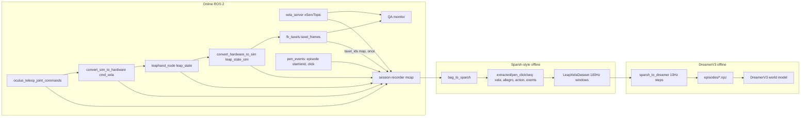

# Sparsh-style pen-click data pipeline for offline DreamerV3

Record teleoperated pen-clicking episodes on the LEAP+Xela hand, following Sparsh-skin's recording and extraction pattern:

1. Record raw mcap bags.
2. Extract them into per-sequence pickles.
3. Turn those into resampled, baseline-subtracted tactile windows with taxel positions from forward kinematics (FK).

Then convert the windows into fixed-rate DreamerV3 offline episodes containing obs, action, reward and is_first/is_last/is_terminal.

References:
- [Sparsh-skin project page](https://akashsharma02.github.io/sparsh-skin-ssl/)
- [Sparsh-skin dataset](https://huggingface.co/datasets/facebook/sparsh-skin-dataset)
- [sparsh-multisensory-touch code](https://github.com/facebookresearch/sparsh-multisensory-touch)

## Progress

- [ ] **click-signal**: Add a pen-click and episode marker topic (Oculus button or keyboard), so episodes have boundaries and reward labels.
- [ ] **recorder**: Add an mcap session recorder to `launch_data_collection.py`, covering task/object/seq_id, `meta.yaml`, a baseline mode, and the teleop action topics.
- [ ] **joint-rate**: Make the `leaphand_node` publish rate a parameter (target 50 to 100 Hz).
- [ ] **qa-node**: Turn `sparsh_skin_data_processor` into a live quality monitor, and move the unpack helpers to a shared module.
- [ ] **extractor**: Write `bag_to_sparsh.py`, which produces the Sparsh layout in FLATTEN order plus the action and event pickles.
- [ ] **dataset**: Add a LeapXela Sparsh-style Dataset in the vendored `tactile_ssl` (resampling, outlier mask, baseline, FK positions, windows).
- [ ] **dreamer-export**: Write `sparsh_to_dreamer.py`, which steps at 10 Hz and writes DreamerV3 episode `.npz` files (raw tactile, plus an optional frozen Sparsh-skin embedding).
- [ ] **protocol**: Document the pen-click teleop protocol, the episode definition, and the train/val split by sequence id.
- [ ] **e2e-check**: Validate end to end: Sparsh sample shape, sensor layout plot, encoder forward pass, and DreamerV3 replay loading one episode.

## Task

The mechanical pen rests on top of the LEAP+Xela hand. You teleoperate the hand with the Oculus to click the pen; the commands go `oculus_teleop_joint_commands`, then `convert_sim_to_hardware`, then `cmd_xela`. The data is used to train a DreamerV3 world model offline. DreamerV3 needs three things that Sparsh's pretraining data does not provide:

- **Actions.** Sparsh never records commands. Dreamer needs the action taken at every step.
- **Fixed-rate steps and episode boundaries.** Each step needs `is_first`, `is_last` and `is_terminal`.
- **Reward.** Here, that is a pen click.

So the plan has two parts. The first reuses Sparsh's recording, extraction and preprocessing as they are. The second is a new exporter that turns the processed sequences into Dreamer episodes.

## How Sparsh-skin does it (reference)

- **Record raw data only.** Each sequence is one `.mcap` bag of about 2 minutes. The topics that matter here are `/xServTopic` and the hand's `joint_states`. Train/val splits are made by sequence id.
- **Offline extraction** ([scripts/xela/convertbag2dataset.py](../../sparsh-multisensory-touch/scripts/xela/convertbag2dataset.py)) writes, per sequence:
  - `<object>/<seq>/xela/data.pkl`, a list of `(368, 4)` arrays holding `[t, x, y, z]`;
  - `xela/forces.pkl`;
  - `allegro/data.pkl`, holding `{"joint_states": [t, q16, eff16]}`.

  Timestamps come from the message header, or from the bag stamp if the header is empty, and are relative to a shared t0. A `baseline/` recording of the hand at rest and a `urdf/` folder are stored alongside.
- **Processing in the Dataset** ([tactile_ssl/data/xela_tactile.py](../../sparsh-multisensory-touch/tactile_ssl/data/xela_tactile.py)) runs these steps in order:
  - cubic-spline resampling to 100 Hz;
  - outlier masking, where values outside 20000 to 60000 become 0 (explained in the next section);
  - baseline-mean subtraction;
  - forward kinematics to 368 taxel positions in `XELA_FLATTEN_ORDER`;
  - global mean and standard deviation normalisation;
  - 0.1 s windows, giving encoder input `(10, 368, 6)`.

## What the raw Xela data is

- **Source.** Each uSkin taxel has a magnet in soft silicone above a 3-axis Hall-effect magnetometer chip. Pressing the taxel moves the magnet, which changes the measured field.
- **Format.** For each taxel, `/xServTopic` gives `taxel.x`, `taxel.y` and `taxel.z` as unsigned 16-bit counts from 0 to 65535. These counts have no physical units and are uncalibrated.
  - `z` mostly reflects normal pressure; `x` and `y` mostly reflect shear.
  - Rest values differ from taxel to taxel, which is why a per-taxel baseline is subtracted.
  - Contact moves the values by hundreds to a few thousand counts.
- **`forces` field.** This is Xela's own calibrated estimate in newtons, and it is filled in only if xela_server has calibration. Sparsh trains on the raw counts. We store `forces` in `xela/forces.pkl` as a side channel only.
- **Outlier band 20000 to 60000.** Healthy readings sit in this band, around the middle of the 16-bit range. Readings outside it come from:
  - communication glitches, which show up as 0 or 65535;
  - dead or saturated chips;
  - magnetic interference.

  Sparsh's own data had bad sensors at indices 104 and 145.
- **What 0 means after masking.** Sparsh sets out-of-band values to 0 to mark them invalid.
  - Masked taxels skip baseline subtraction.
  - `compute_xela_normalization` treats 0 as NaN.
  - After subtraction, valid taxels become deltas from rest, which are close to 0 when nothing touches them.

  As a result, a dead taxel looks the same as an untouched one: the fault is hidden, not flagged.
- **The band must be checked on this hand.** The 20000 to 60000 band was tuned for Meta's Allegro hand. Before collecting at scale, plot per-axis histograms of a baseline recording and of a recording with hard pen clicks. If any taxels rest near either cutoff or saturate during a click, set new limits.
  - Store the limits as `xela_valid_min` and `xela_valid_max` in the data config.
  - Record the list of dead or saturated taxels in `extracted/meta.yaml`.
  - Optionally export a per-step `tactile_valid` mask in the Dreamer episodes, so the model can tell missing data apart from no contact.

## Findings in the existing code that shape the plan

- [sparsh_skin_data_processor.py](mechanical_pen_data_collection/sparsh_skin_data_processor.py) pairs each Xela message with the latest FK frame in real time. Nothing is saved, and the pairing has timing jitter. Move the pairing offline.
- [leaphand_node.py](../../../LEAP_Hand_API/ros2_module/scripts/leaphand_node.py) publishes `leap_state` at 10 Hz from a 0.1 s timer. That matches the Dreamer step rate, but it is too sparse for reliable spline interpolation and gives no detail between steps. Raise it to 50 to 100 Hz.
- `TaxelFrames` already uses 368 taxels in `XELA_FLATTEN_ORDER`, with a `taxel_ids` map. That makes our data match the pretrained encoder's layout.
- The Sparsh repo is vendored at `ros_ws/src/sparse_skin/sparsh-multisensory-touch`.
- LEAP geometry differs from Allegro, so the pretrained encoder has never seen positions like ours. Fine-tune Sparsh-skin on our own data, or feed raw tactile data to Dreamer.

## Data flow



## On-disk layout

```
data/sparsh_leap/
  raw/pen_click/<pen_id>/<seq_id>/      # mcap bag + meta.yaml (operator, pen, pen placement, notes)
  extracted/
    baseline/xela/data.pkl              # 15 s, hand untouched, pen removed; one per session
    urdf/                               # LEAP+Xela urdf used by FK
    taxel_map.npy                       # hardware id -> FLATTEN order
    pen_click/<pen_id>/<seq_id>/
      xela/data.pkl, xela/forces.pkl    # (368, 4) per msg, FLATTEN order (Sparsh format)
      allegro/data.pkl                  # leap_state_sim joints [t, q16, eff16]; name kept for Sparsh loaders
      action/data.pkl                   # [t, q16] from oculus_teleop_joint_commands (sim frame)
      events.pkl                        # [(t, "episode_start"|"click"|"episode_end"|"fail")]
      meta.yaml
  dreamer/
    train/<pen_id>_<seq>_<ep>.npz
    val/...
```

Xela data is reordered into FLATTEN order during extraction, using `taxel_map.npy`. Do not keep `msg.sensors` order as Sparsh does, because our hardware order is different.

## DreamerV3 episode format (exporter output)

The control step is 10 Hz, so each step lines up with exactly one 0.1 s Sparsh window. For each step the exporter writes:

- `tactile`: `(10, 368, 3)`, baseline-subtracted and normalised. This is the raw-tactile option.
- `taxel_pos`: `(368, 3)`, the FK positions at the end of the window.
- `sparsh`: an embedding from a frozen or fine-tuned Sparsh-skin encoder. This is optional, and is a compact alternative to `tactile`.
- `joints`: `(16,)` positions in the sim frame, plus optionally `(16,)` efforts.
- `action`: `(16,)` teleop joint target at the step, scaled to [-1, 1] by the joint limits. A delta-position action is available as a config option.
- `reward`: 1.0 on the step where a click event falls, otherwise 0. Dense shaping can be added later.
- `is_first`, `is_last`, `is_terminal`: `is_terminal` is True on a click when each episode is one click. `is_last` without `is_terminal` marks a timeout or truncation.
- `tactile_valid` (optional): `(368,)` bool, true if the taxel stayed in band for the whole window.

Dreamer encodes vector observations with an MLP. Flatten `tactile` or use `sparsh`, and keep the key names configurable in the exporter.

## Steps

1. **Click and episode markers.** Add a small node that publishes `pen_events`, as a stamped string or a custom message.
   - Oculus controller buttons or keyboard keys mark episode start, click, episode end and failure.
   - The operator's click label is the ground-truth reward.
   - As an offline check, also flag clicks automatically from the tactile signal: a pen click shows up as a sharp drop in normal force on the pressing fingertip.
2. **Recorder.** Extend [launch_data_collection.py](launch/launch_data_collection.py) with `record:=true`, `pen_id`, `seq_id` and `mode:=baseline|pen_click`.
   - Run `ros2 bag record -s mcap` on `xServTopic`, `leap_state`, `leap_state_sim`, `oculus_teleop_joint_commands`, `cmd_xela` and `pen_events`, plus a throttled copy of `taxel_frames`.
   - Write `meta.yaml`.
3. **Joint rate.** Make the `leaphand_node` timer a parameter, defaulting to 0.01 to 0.02 s.
4. **QA monitor.** Repurpose `sparsh_skin_data_processor` to report:
   - per-topic rates;
   - how stale the FK and teleop data are;
   - dead or saturated taxels, meaning raw counts outside `xela_valid_min` to `xela_valid_max` (default 20000 to 60000);
   - the delta from baseline, in raw counts;
   - the number of clicks per episode.

   Move the unpack helpers into a shared module.
5. **Extractor** (`bag_to_sparsh.py`). Base it on `convertbag2dataset.py`. Reorder Xela data with `taxel_map`, and write the Sparsh-format pickles plus `action/data.pkl` and `events.pkl`.
   - Keep the raw `uint16` counts unchanged; do no masking here.
   - Write per-taxel validity statistics to `extracted/meta.yaml`: the fraction of samples out of band, and the min, max and median per axis.
6. **Sparsh Dataset.** Add `tactile_ssl/data/leap_xela_tactile.py`, adapted from `XelaSSLDataset` to use LEAP forward kinematics, and `config/data/leap_xela.yaml`. Use it to fine-tune Sparsh-skin on our data, and reuse it as the exporter's preprocessing.
   - Read the outlier band from the config as `xela_valid_min` and `xela_valid_max`, instead of hardcoding 20000 and 60000.
   - Return a validity mask alongside the sensor data.
   - Add a helper that plots raw-count histograms for a baseline sequence and a pen-click sequence, to help set the band.
7. **Dreamer exporter** (`sparsh_to_dreamer.py`).
   - Resample everything to 100 Hz using the Dataset.
   - Split each sequence at the episode markers.
   - Step at 10 Hz, building each observation from the previous 0.1 s window.
   - Take the action at each step time from the teleop commands, holding the last command until a new one arrives.
   - Attach reward and done flags from `events.pkl`.
   - Write one `.npz` per episode, split into train and val by sequence id.
   - Store normalisation statistics and action scaling in `dreamer/meta.yaml`.
8. **Protocol.**
   - Before the first real session, record one baseline and one sequence of hard pen clicks, and use the histogram helper to confirm or adjust the 20000 to 60000 band for this hand.
   - At the start of each session, record a baseline with the pen removed.
   - Run episodes of up to about 10 to 15 s, from reset to click, and re-place the pen between episodes.
   - Collect 10 or more sequences of about 2 minutes each per pen and placement.
   - Vary finger choice and approach. Deliberately include failed or no-click attempts, so the world model sees dynamics that earn no reward.
   - Hold out whole sequence ids for validation.
9. **End-to-end check.**
   - Confirm a `(10, 368, 6)` Sparsh sample and check the `xela_sensor_layout` plot.
   - Run the encoder forward pass.
   - Load one `.npz` episode into DreamerV3's offline replay, check its keys and shapes, and confirm the reward lines up with the click signature in the tactile signal.
